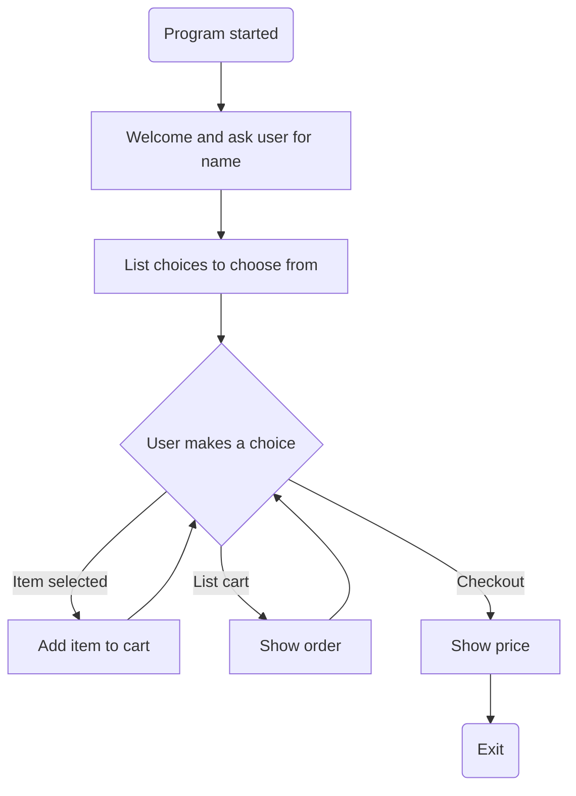

```mermaid
flowchart TD
  start(Program started) -->
  name[Welcome and ask user for name] -->
  list[List choices to choose from] -->
  user_choice{User makes a choice}
  user_choice -->|Item selected| add_to_cart[Add item to cart] --> user_choice
  user_choice -->|List cart| print_order[Show order] --> user_choice
  user_choice -->|Checkout| print_price[Show price] --> exit(Exit)
```
