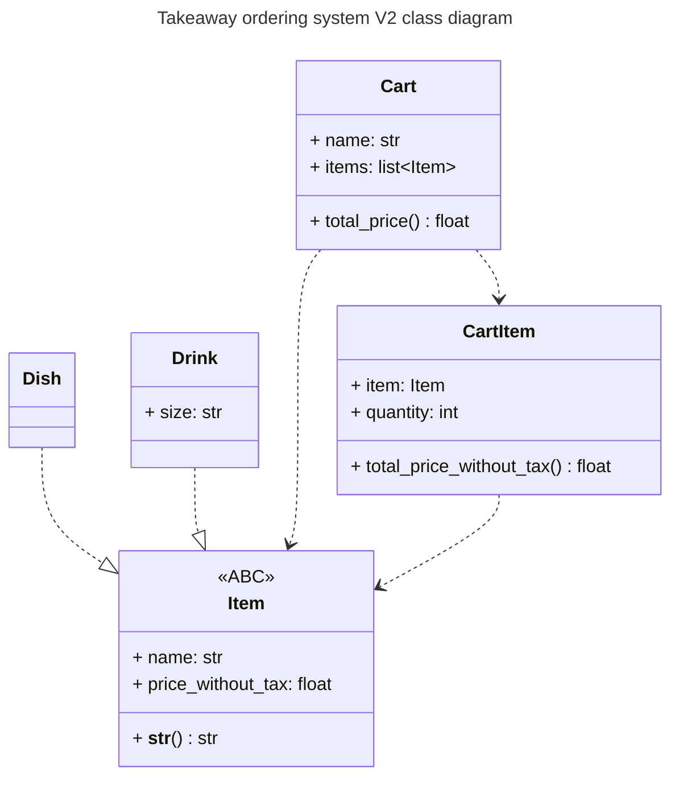

```mermaid
---
title: Takeaway ordering system V2 class diagram
layout: elk
---

%% Order:
%% - public fields
%% - private fields
%% - public methods
%% - private methods

classDiagram
  direction TD

  %% Inheritance
  %%A --|> B
  %% Implementation
  Dish ..|> Item
  Drink ..|> Item
  %% Dependency
  Cart ..> Item
  Cart ..> CartItem
  CartItem ..> Item

  class Item <<ABC>> {
    + name: str
    + price_without_tax: float
    + __str__() str
  }

  class Dish {
  }
  
  class Drink {
    + size: str
  }

  class CartItem {
    + item: Item
    + quantity: int
    + total_price_without_tax() float
  }

  class Cart {
    + name: str
    + items: list~Item~
    + total_price() float
  }
```
