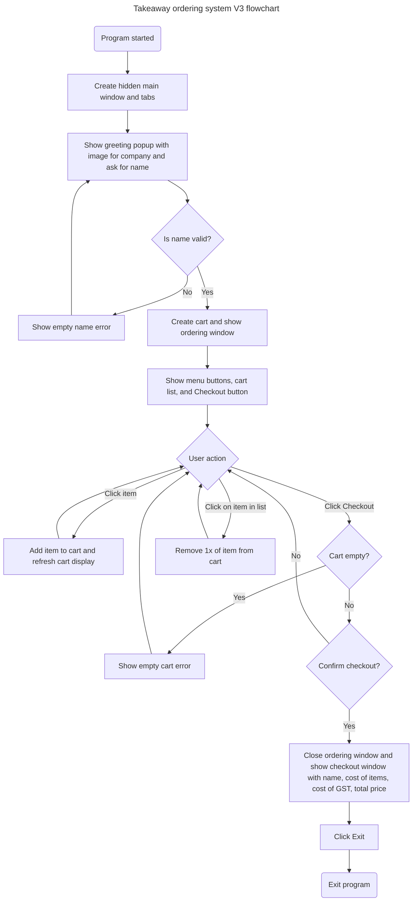

```mermaid
---
title: Takeaway ordering system V3 flowchart
---

flowchart TD
  start(Program started) -->
  init[Create hidden main window and tabs] -->
  greet[Show greeting popup with image for company and ask for name] -->
  name_check{Is name valid?}

  name_check -->|No| name_error[Show empty name error] --> greet
  name_check -->|Yes| create_cart[Create cart and show ordering window] --> ordering

  ordering[Show menu buttons, cart list, and Checkout button] --> action{User action}
  action -->|Click item| add_item[Add item to cart and refresh cart display] --> action
  action -->|Click Checkout| cart_check{Cart empty?}
  action -->|Click on item in list| remove[Remove 1x of item from cart] --> action


  cart_check -->|Yes| empty_error[Show empty cart error] --> action
  cart_check -->|No| confirm{Confirm checkout?}
  confirm -->|No| action
  confirm -->|Yes| checkout[Close ordering window and show checkout window with name, cost of items, cost of GST, total price] --> exit_click

  exit_click[Click Exit] --> exit(Exit program)
```
