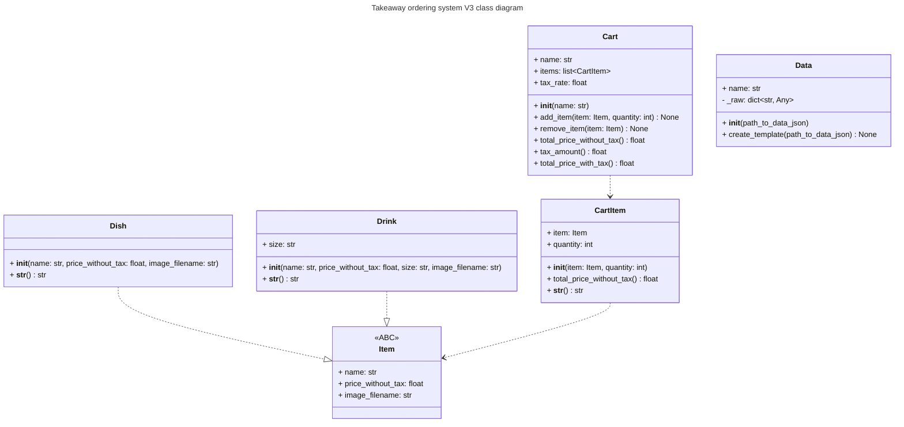

```mermaid
---
title: Takeaway ordering system V3 class diagram
layout: elk
---

%% Order:
%% - public fields
%% - private fields
%% - public methods
%% - private methods

classDiagram
  direction TD

  %% Inheritance
  Dish ..|> Item
  Drink ..|> Item
  %% Dependency
  Cart ..> CartItem
  CartItem ..> Item

  class Item <<ABC>> {
    + name: str
    + price_without_tax: float
    + image_filename: str
  }

  class Dish {
    + __init__(name: str, price_without_tax: float, image_filename: str)
    + __str__() str
  }

  class Drink {
    + size: str
    + __init__(name: str, price_without_tax: float, size: str, image_filename: str)
    + __str__() str
  }

  class CartItem {
    + item: Item
    + quantity: int
    + __init__(item: Item, quantity: int)
    + total_price_without_tax() float
    + __str__() str
  }

  class Cart {
    + name: str
    + items: list~CartItem~
    + tax_rate: float
    + __init__(name: str)
    + add_item(item: Item, quantity: int) None
    + remove_item(item: Item) None
    + total_price_without_tax() float
    + tax_amount() float
    + total_price_with_tax() float
  }

  class Data {
    + name: str
    - _raw: dict~str, Any~
    + __init__(path_to_data_json)
    + create_template(path_to_data_json) None
  }
```
