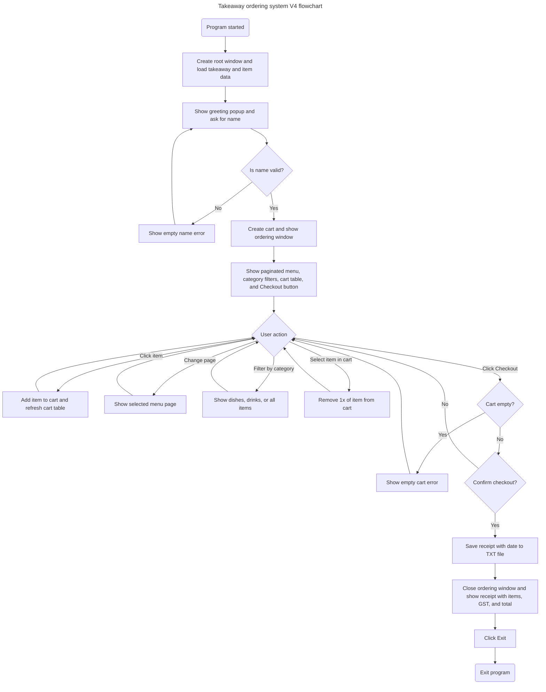

```mermaid
---
title: Takeaway ordering system V4 flowchart
---

flowchart TD
  start(Program started) -->
  init[Create root window and load takeaway and item data] -->
  greet[Show greeting popup and ask for name] -->
  name_check{Is name valid?}

  name_check -->|No| name_error[Show empty name error] --> greet
  name_check -->|Yes| create_cart[Create cart and show ordering window] --> ordering

  ordering[Show paginated menu, category filters, cart table, and Checkout button] -->
  action{User action}
  action -->|Click item| add_item[Add item to cart and refresh cart table] --> action
  action -->|Change page| page[Show selected menu page] --> action
  action -->|Filter by category| filter[Show dishes, drinks, or all items] --> action
  action -->|Select item in cart| remove[Remove 1x of item from cart] --> action
  action -->|Click Checkout| cart_check{Cart empty?}

  cart_check -->|Yes| empty_error[Show empty cart error] --> action
  cart_check -->|No| confirm{Confirm checkout?}
  confirm -->|No| action
  confirm -->|Yes| save[Save receipt with date to TXT file] -->
  checkout[Close ordering window and show receipt with items, GST, and total] -->
  exit_click

  exit_click[Click Exit] --> exit(Exit program)
```
